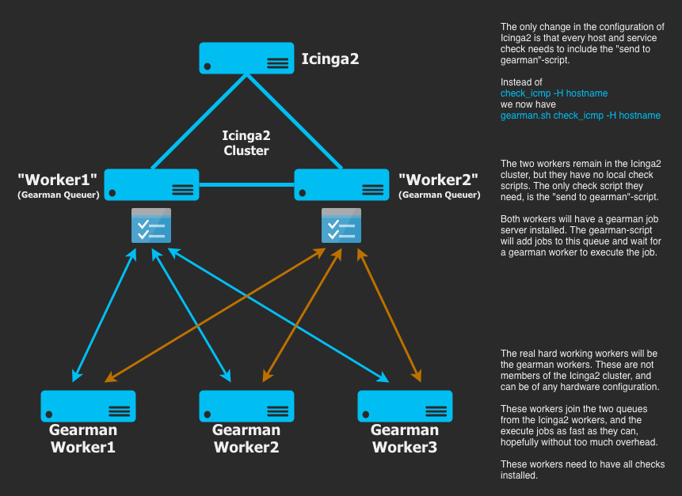

# icinga2-gearman
Icinga2 with Gearman workers

## Purpose
We have 3000+ hosts and 17000+ services in our Icinga2 installation. Most checks are executed once every 5 minutes, but we also have a lot of checks that needs to be executed more often - like every minute or less. Due to a bug in Icinga2 (_The Zone object 'worker' has more than two endpoints. Due to a known issue this type of configuration is strongly discouraged and may cause Icinga to use excessive amounts of CPU time._) we shouldn't use more than two satellites, or workers as we used to call them. But we have too many checks for two workers to handle, so we absolutely need to have more than two to make Icinga2 run.

This scales really bad for two reasons. The obvious one is the bug described above. More than two satellites adds excessive CPU time. The other reason is that the Icinga2 cluster divides workloads *evenly* across all satellites. If you have 4 satellites with different hardware, your slowest server will have 25% of the total workload if you don't dedicate checks to specific servers (which is a bad idea in case that server has a problem).

Additionally, there is a lot of problem when we need to reload the Icinga2 Master to refresh new configuration. We want to do this as often as possible to make sure we are up to date with all changes in the network, but every time we reload, the CPU and number of processes on all the workers spike and go bananas. This lasts for at least 10-15 minutes.

I really liked the mod-gearman-tools for Icinga1 where all the satellites/workers ran gearman. You could add and remove workers as you saw fit, and the hardware config could be totally different. Each worker just does how much he _can_ of the workload.

So what I wanted to to, was to put gearman into play also for Icinga2.

(**NOTE**: We run Debian on everything, so references to packages and other things may vary across other Linux distos)

## Quick and dirty howto

### Diagram


### Icinga2 Master, Satellites and Workers
So what I want to do is to offload all the work from the Icinga2 workers (from now on called **satellites**), and move that workload down to gearman workers (from now on called just **workers**). I still want to have two satellites for redundancy, but the only task these two servers have is to add jobs to the gearman job server and present the results back to the master Icinga2 server. The CPU load on these two satellites will be pretty low, so there is no need for high end servers here.

### Satellites
Both satellites must be part of the Icinga2 cluster. This must be set ut normally as per the Icinga2 documentation. Additionally they need the gearman-job-server package. As long as the gearman-job-server is running, the workers will add their gearman processes to specific queues. Remember to change the IP-address in /etc/default/gearman-job-server. The last line will say `PARAMS="--listen=127.0.0.1"` Change this to the IP-address of the server.

The satellites need to have just a single check-script in the /usr/lib/nagios/plugins directory, namely **gearman_check.sh**. This script is included in the repo. There is, of course, no problem if you have other check scripts in the same directory, but they will not be used.

The purpose of gearman_check.sh is to add all the jobs from the Icinga2 Master to the gearman job server. 

### Workers
The Gearman worker servers will need to have the full range of check scripts that you wish to use in your Icinga2 config. They will run multiple instances of the **icinga2_gearman_worker.sh** script. I have placed this script inside the home directory of the nagios user: /var/lib/nagios/, and chowned it to nagios.  Remember that this needs to be done for all your workers. We have 6, so Saltstack or similiar software is your friend.

In addition they will need the gearman-tools package installed.

Each gearman worker process will add 1 worker (thread) to the gearman job server queue. This means that the icinga2_gearman_worker.sh script needs to be started 10 times to add 10 workers to the queue. And this is just for the queue on one of the two satellites, I will need to start 10 more to get 10 workers on the queue on satellite 2. This is a lot of work to handle manually, so I needed to do this as systemd services that I can easily control and that will be automatically started when the server reboots.

In /etc/systemd/system I created two files:

**satellite1-gearman@.service**
```
[Unit]
Description=Satellite1 Gearman Service instance %i
After=network.target

[Service]
Type=simple
User=nagios
WorkingDirectory=/var/lib/nagios
ExecStart=/usr/bin/gearman -w -h satellite1 -p 4730 -f icinga2 /usr/bin/xargs /var/lib/nagios/icinga2_gearman_worker.sh
Restart=always

# Restart service after 10 seconds if node service crashes
RestartSec=10

# Output to syslog
StandardOutput=syslog
StandardError=syslog
SyslogIdentifier=satellite1-gearman

[Install]
WantedBy=multi-user.target
```

**satellite2-gearman@.service**
```
[Unit]
Description=Satellite2 Gearman Service instance %i
After=network.target

[Service]
Type=simple
User=nagios
WorkingDirectory=/var/lib/nagios
ExecStart=/usr/bin/gearman -w -h satellite2 -p 4730 -f icinga2 /usr/bin/xargs /var/lib/nagios/icinga2_gearman_worker.sh
Restart=always

# Restart service after 10 seconds if node service crashes
RestartSec=10

# Output to syslog
StandardOutput=syslog
StandardError=syslog
SyslogIdentifier=satellite1-gearman

[Install]
WantedBy=multi-user.target
```

After this, you need to enable as many worker processes as you want for each of the two satellites. If you want to add 30 workers (threads) to the gearman job server queue, you enable them like this:

```
systemctl enable satellite1-gearman\@{1..30}.service
systemctl enable satellite2-gearman\@{1..30}.service
```

Then you can start the processes like this:

```
systemctl start satellite1-gearman\@{1..30}
systemctl start satellite2-gearman\@{1..30}
```

To check that your workers have joined the queue, you can use gearman_top:

```
# gearman_top -H satellite1:4730

 Queue Name   | Worker Available | Jobs Waiting | Jobs Running
---------------------------------------------------------------
 icinga2      |              30  |           0  |           0
---------------------------------------------------------------
```

This is a nice tool for monitoring the queues after you add all the workers and start adding real jobs.

### Checks
The checks in icinga2 needs to be rewritten so that they start with "gearman_check.sh <original full check>". Example:

```
object CheckCommand "check_hostname_cpu" {
   import "plugin-check-command"
   command = PluginDir + "/gearman_check.sh check_snmp -C xxx -o cpmCPUTotal5minRev.2 -u % -w :70 -c :80 -l CPU_RSP0 -H hostname"
```

In addition, you have to change the checks that are included as plugins in Icinga2. These checks can be found in the file /usr/share/icinga2/include/command-plugins.conf. This can be done for all plugins using sed like this:

```
sed -i 's/command = \[ PluginDir + \"\//command = \[ PluginDir + \"\/gearman_client.sh /g' /usr/share/icinga2/include/command-plugins.conf
```

## Status
After a lot of testing in our lab, we decided to put everything into production. As of January 2019 we have 2 satellites and 6 workers, and everything is running really smooth. We can reload the Icinga2 Master as often as we want. We can restart a worker without **any** impact of the other servers (other that a small, shared increase in load, which is expected). Our two satellites have 4 CPU cores and 8 GB of RAM, and the average load is around 1.5 with an average of 60-70 gearman jobs running at all times.

```
# gearman_top -H satellite1:4730

 Queue Name   | Worker Available | Jobs Waiting | Jobs Running
---------------------------------------------------------------
 icinga2      |             360  |           0  |          83
---------------------------------------------------------------
```

So in conclusion we have two extra servers to handle, but we finally have a stable Icinga2 installation that runs smoothly without load and process spikes even if we reload every 30 minutes. Additionally we can add and remove workers as we wish, and we can easily use old servers with less hardware specs, and just tune the number of worker processes we run on them.
